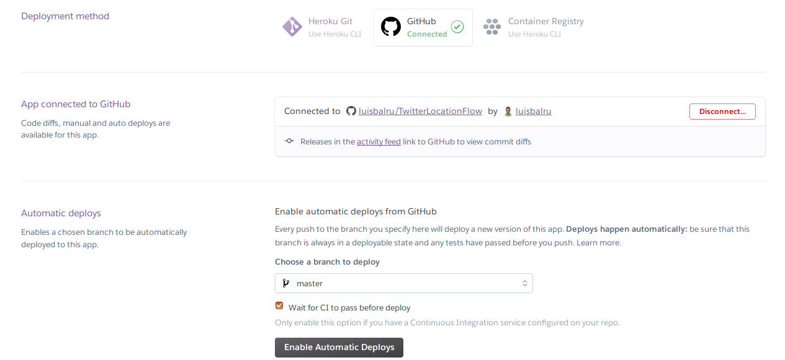

# HEROKU

## Instalación, creación y despliegue de la app en Python

1) Crear cuenta en Heroku
2) Instalar Heroku CLI (toolbet)
	`$ sudo snap install heroku --classic`
	
3) Login
	`$ heroku login`

4) En el directorio principal de la app, creamos la aplicación Heroku
	`$ heroku create <nombre_app>`
	(Importante añadir el nombre; si no, te pone uno por defecto)
	
5) Configurar `.git/config` para así tener la app en remote 

6) Añadir un archivo Procfile a tu repositorio.

7) Ajustar *requirements.txt* y *runtime.txt* a las necesidades actuales (en mi caso, gunicorn)

6) Desplegar
	`$ git push heroku master`
	
7) En tu perfil de Heroku, configuramos el despliegue automático a través de Github

8) Comprobar que la aplicación está desplegada correctamente.
	`$ heroku open`

9) En caso de que no funcionara, estudiar logs y desplegar en local para depurar errores:

	`$ heroku logs`
	
	`$ heroku local web`