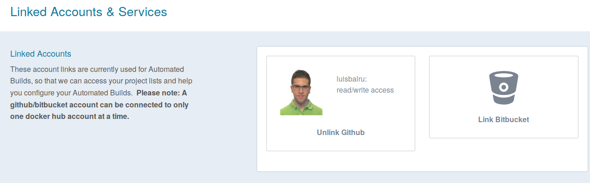
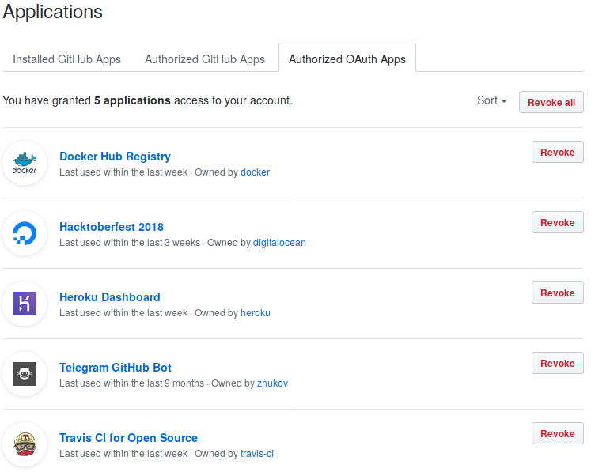
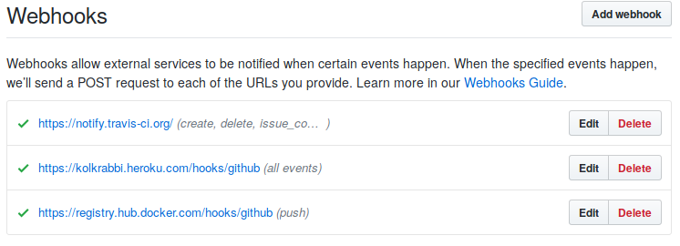

# CONFIGURE AUTOMATED BUILDS ON DOCKER HUB

## Link to a hosted repository service

1. Link into Docker Hub.
2. Navigate to Profile > Settings > Linked Accounts & Services.  
3. Click the service you want to link (Github).  
4. Press Select under Public and Private connection type.  

## Create an automated build

1. Select Create >  Create Automated Build (from the drop down, upper right) on Docker Hub.  
2. Select from the User/Organizations.  
3. Pick the project to build.  
4. Customize your automated build.  
5. Click Create.  

# Configure automated builds from GitHub

- Applications

- Webhooks

Further information at [DockerHub](https://docs.docker.com/docker-hub/github/#github-organizations)

