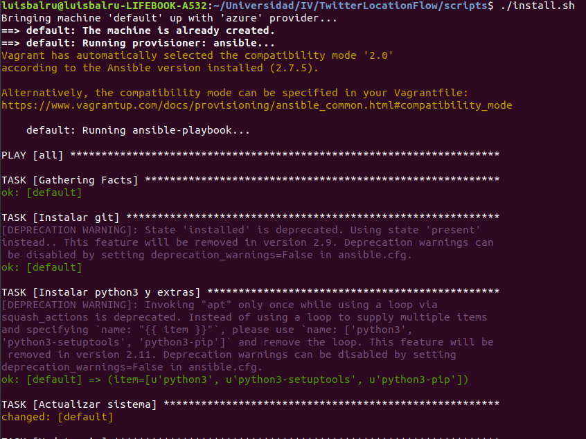
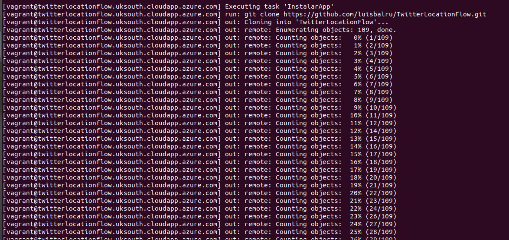
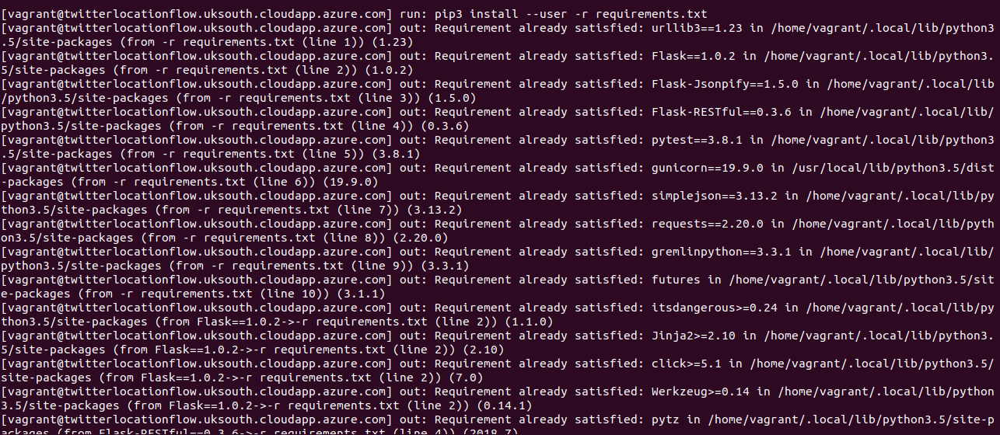
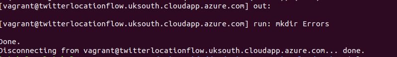
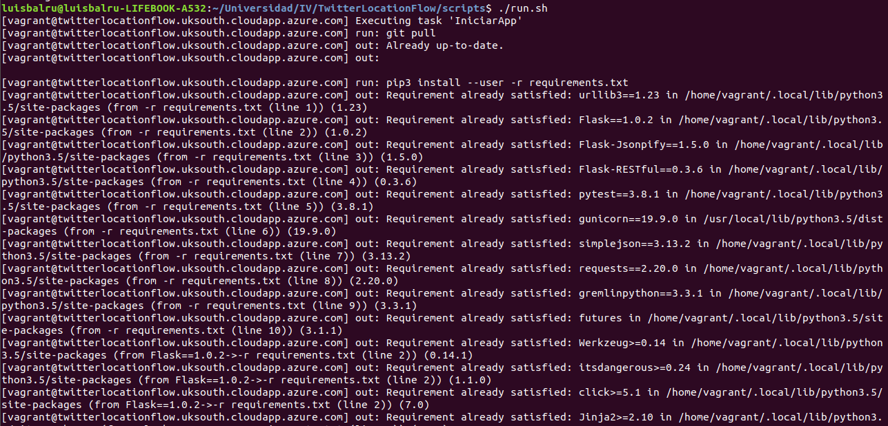
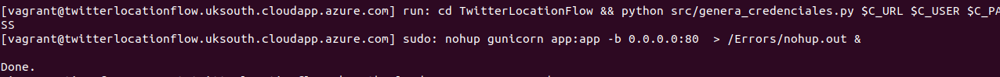
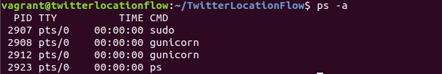
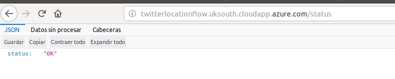

# DESPLIEGUE CON FABRIC

Para el despliegue utilizo la herramienta Fabric. [Aquí](http://docs.fabfile.org/en/2.4/) está la documentación oficial.

En el fabfile.py defino tres funciones:

- InstalarApp: Hace un clon del proyecto de Github, instala sus dependencias y crea el directorio Errors (para las salidas de nohup)
- ActualizarApp: En el directorio del proyecto hace un pull e instala las nuevas dependencias (si hubiere).
- IniciarApp: ActualizaApp, genera variables de entorno, se las pasa a la máquina remota y genera credenciales allí y, por último, ejecuta la aplicación.
- KillApp: Al lanzar la app, guardo un fichero el número del PID de ese proceso. Cuando se lanza KillApp, se recupera el contenido de ese fichero y se detiene el proceso.

Estas funciones son llamadas a través de los scripts install.sh (crea la máquina, la provisiona e instala la app), run.sh y kill.sh, tomando el papel de botón para instalar, ejecutar y acabar la app.

**Creando la máquina virtual y provisionando con Ansible**

**Instalando App**

**Instalando dependecias**

**Creando Carpeta de errores**

**Ejecutando la App**

**Generando credenciales y lanzando app**

**Comprobando que hay un proceso en ejecución de gunicorn**

**Prueba en el navegador**

**REFERENCIAS**
- [Fabricate your automated devops environment using python](https://www.youtube.com/watch?v=g4rCFMWAwgo)
