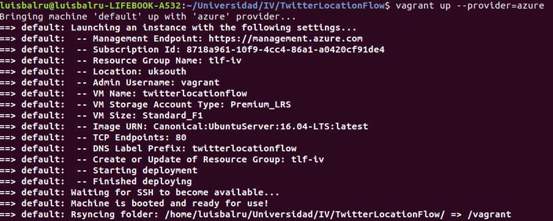

# CREACIÓN Y PROVISIONAMIENTO

## Vagrantfile

El primer cometido de un Vagrantfile es describir qué tipo de máquina requiere el proyecto y cómo se va a configurar. Vagrant genera un entorno fácil de configurar, reproducible y portable que consigue construir nuestra aplicación en un único flujo consistente. En mi caso, construyo una máquina virtual en Azure y una red virtual privada con la que conectar mi máquina virtual y mi base de datos. Debido a las necesidades de mi proyecto, la base de datos está basada en un grafo y aprovechando las herramientas que Microsoft Azure nos da, he elegido Gremlin (GDB) dentro de CosmosDB.  

Para poder crear esta máquina, es necesario tener un Service Principal y un grupo de recursos.

La máquina virtual generada tiene las siguientes características:

- Sistema operativo: Ubuntu Server 16.04 LTS
- Tamaño: Standard_F1
- Localización: Sur de Reino Unido

### Provisionamiento con Ansible

Ansible es el software que he elegido para provisionar la máquina recién creada. La orden de provisionamiento se da también en el Vagrantfile, haciendo referencia al *playbook.yml* que se ha definido previamente. Paso a describir mi *playbook.yml*:  

Para el correcto funcionamiento de mi app, es necesario tener  git, python (Python3) y sus herramientas, y gunicorn. Por ello, utilizo un task con el módulo apt para instalar git, otro con un bucle para instalar todo lo concerniente a python (actualizando los repositorios previamente con *update_caché:yes*) y después tasks con comandos específicos para la actualizacion de pip y la instalación de gunicorn.  
Como curiosidad, quiero comentar que en el Vagrantfile he añadido *run:always* para que cada vez que se ejecute, provisione la máquina.

